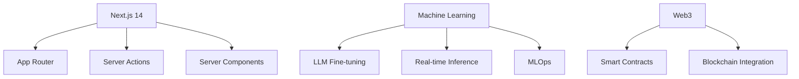

# 👋 Hello World! I'm Thapelo Ndlovu

[](https://github.com/Heisenburg-z)
[](https://github.com/Heisenburg-z)
[](https://github.com/Heisenburg-z)
[](https://portfolio-43d9b.web.app/)
[](https://www.chess.com/member/thapelo_ndlovu)
[](https://www.sololearn.com/en/profile/24239495)

## 🚀 **About Me**

```python
class Developer:
    def __init__(self):
        self.name = "Thapelo Ndlovu"
        self.interests = ["Web Development", "Machine Learning", "Open Source"]
        self.current_tech_stack = ["Next.js", "React", "Python", "TensorFlow"]
        self.learning = ["Advanced Full-Stack Patterns", "ML Ops"]
        self.hobbies = ["Chess ♟️", "Solving Rubik's Cubes 🧩", "Continuous Learning 📚"]
        
    def say_hi(self):
        print("Let's build something revolutionary!")

me = Developer()
me.say_hi()
```

## 🔥 **Tech Stack Arsenal**

### 🛠️ **Core Technologies**


### 🗄️ **Database & Tools**


## 📊 **GitHub Activity**

<div align="center">
  
</div>

<div align="center">
  
</div>

<div align="center">
  
</div>

## 🎯 **Current Projects**

<table>
  <tr>
    <td align="center">
      <a href="https://github.com/Heisenburg-z/project-name">
        
        <br />
        <sub><b>ML Model Deployment Pipeline</b></sub>
      </a>
      <br />
      <sub>TensorFlow + Docker + AWS</sub>
    </td>
    <td align="center">
      <a href="https://github.com/Heisenburg-z/project-name">
        
        <br />
        <sub><b>Next.js E-Commerce Platform</b></sub>
      </a>
      <br />
      <sub>Next.js + MongoDB + Stripe</sub>
    </td>
    <td align="center">
      <a href="https://github.com/Heisenburg-z/project-name">
        
        <br />
        <sub><b>Contributing to Open Source</b></sub>
      </a>
      <br />
      <sub>React + TypeScript + Docker</sub>
    </td>
  </tr>
</table>

## 🧩 **Current Learning Journey**


## ♟️ **Chess Enthusiast**
<div align="center">
  <a href="https://www.chess.com/member/thapelo_ndlovu">
    
  </a>
  <p><i>Challenge me to a game! Current rating: ≈1200</i></p>
</div>

## 🤯 **Fun Fact Zone**
> "I built a 🤖 **Rubik's Cube-solving robot** in 72 hours using Arduino and Python!  
> Current personal cube-solving record: **47 seconds** 🏻⏱️"
>
> "When I'm not coding, you'll find me analyzing chess openings or participating in local hackathons!"
>
> "I once debugged a production issue at 3 AM while sleepwalking. The fix worked. ☕"

## 🎓 **Continuous Learning**
<div align="center">
  <a href="https://www.sololearn.com/en/profile/24239495">
    
  </a>
</div>

## 💡 **Philosophy**
> "🚀 *Code should solve problems, not create them*  
> 💡 *The best applications are those that make complexity feel simple*  
> 🔧 *Build to scale from day one, future-you will be grateful*"

## 🤝 **Let's Connect & Collaborate**

[](mailto:thapelondlovu74@gmail.com)
[](https://www.linkedin.com/in/thapelo-ndlovu-1165152aa)
[](https://twitter.com/thapelondlovu8008)
[](https://portfolio-43d9b.web.app/)
[](https://www.sololearn.com/en/profile/24239495)
[](https://www.chess.com/member/thapelo_ndlovu)


[](https://github.com/Heisenburg-z/Heisenburg-z)

---

⭐ *This README is powered by* **Coffee** ☕ *and* **Late Night Coding Sessions** 🌙

<!-- ASCII Art Signature -->
```
 _____  _                      _         _   _      _ _                 
|_   _|| |__   __ _ _ __   ___| | ___   | \ | |  __| | | _____   _____ 
  | |  | '_ \ / _` | '_ \ / _ \ |/ _ \  |  \| | / _` | |/ _ \ \ / / _ \
  | |  | | | | (_| | |_) |  __/ | (_) | | |\  || (_| | | (_) \ V / (_) |
  |_|  |_| |_|\__,_| .__/ \___|_|\___/  |_| \_| \__,_|_|\___/ \_/ \___/ 
                   |_|                                                 
```
