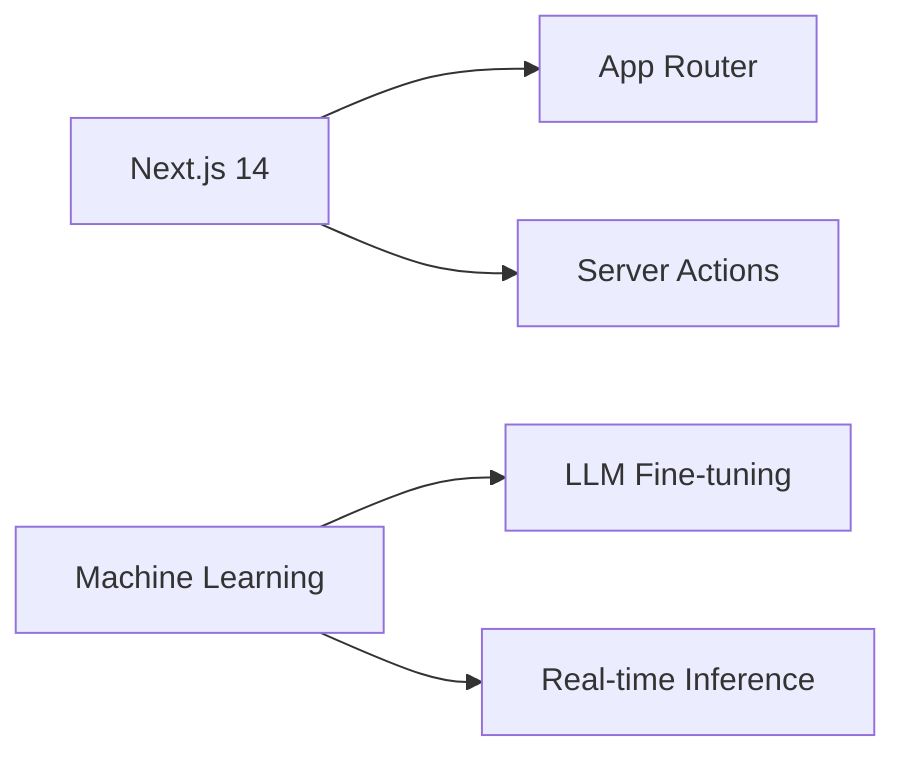

```markdown
# 👋 Hello World! I'm Thapelo Ndlovu

[](https://github.com/Heisenburg-z)
[](https://github.com/Heisenburg-z)
[](https://github.com/Heisenburg-z)

## 🚀 **About Me**

```python
class Developer:
    def __init__(self):
        self.name = "Thapelo Ndlovu"
        self.interests = ["Web Development", "Machine Learning", "Open Source"]
        self.current_tech_stack = ["Next.js", "React", "Python", "TensorFlow"]
        self.learning = ["Advanced Full-Stack Patterns", "ML Ops"]
        
    def say_hi(self):
        print("Let's build something revolutionary!")

me = Developer()
me.say_hi()
```
## 🔥 **Tech Stack Arsenal**

### 🛠️ **Core Technologies**


### 🗄️ **Database & Tools**


## 📈 **GitHub Stats**


[](https://git.io/streak-stats)

## 🤝 **Let's Connect & Collaborate**

[](mailto:thapelondlovu74@gmail.com)
[](https://linkedin.com/in/ThapeloNdlovu)
[-1DA1F2?style=flat-square&logo=twitter&logoColor=white)]()

## 🤯 **Fun Fact Zone**
> "I built a 🤖 **Rubik's Cube-solving robot** in 72 hours using Arduino and Python!  
> Current personal cube-solving record: **47 seconds** 🏻⏱️"

## 🧩 **Current Learning Journey**


## 💡 **Philosophy**
> "🚀 *Code should solve problems, not create them*  
> 💡 *The best applications are those that make complexity feel simple*"


[]()

---

⭐ *This README is powered by* **Coffee** ☕ *and* **Late Night Coding Sessions** 🌙  
```
